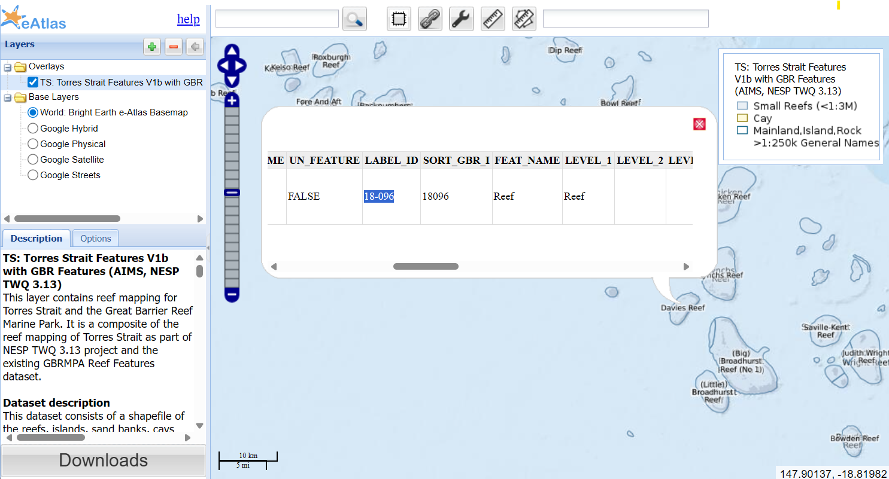

# eReefs reef particle flow demo
This repository contains scripts for combining eReefs with the oceanparcels library to simulate particles dispersing from reefs. Each simulation is setup using a config file. In the current implementation each simulation can specify a set of reefs (specified by their GBRMPA GBR Features LABEL_ID such as 18-068 for Davies reef), a time period for the simulation, the simulation time step and the number of particles. The particles are released randomly across the surface of the reef. Each simulation run run for a set period of time (typically a couple of days). Particles that stray too far away from the reef are deleted from the simulation. The simulation area is specified by a buffer distance around the reef (`buffer_km`).

## Limitations
- Particles follow the currents on a fixed 2D depth layer.
- Particles are deleted when they move off the edge of the downloaded model space.
- No corrections are made for the fine scale effects of water flow over reefs. Water over reefs is sticky because of the fine shallow structure of the coral that is not fully represented by the GBR1 1 km hydrodynamic modelling. 
- The range of simulations possible are limited. 
- The simulation can't work out concentration changes as there is no vertical mixing, just particle movement in a 2D slice.
- While multiple reefs can be simulated in one config file they all share a common date range and other simulation parameters. If you need different dates for different reefs then multiple configs will be needed.
- Downloading the eReefs current data patches for each reef is quite slow. It takes about 8-10 sec per day per reef. If you want long time series for many reefs the downloads can take hours.


## Quick Conda Setup (Miniconda or Anaconda)
If you don't already have Conda:
1. Install (choose one):
	* Miniconda (recommended lightweight): https://docs.conda.io/en/latest/miniconda.html
	* Anaconda (full distribution): https://www.anaconda.com/download
	Accept defaults; on Windows tick "Add Miniconda to PATH" (or use the Anaconda Prompt instead).
2. Open a fresh terminal (or Anaconda Prompt on Windows).
3. Create the project environment from the provided `environment.yml` (this locks compatible versions):
```bash
conda env create -f environment.yml
```

If it already exists and you want to refresh packages:

```bash
conda env update -f environment.yml --prune
```
4. Activate:
```bash
conda activate reef-residency
```
5. Switch to the project directory:
Change the directory of the terminal to the directory of the project code. In Windows you can use Explorer to quickly find this project code, then copy the path from the address bar.

```bash
cd {path to this project source code}
```
6. (Optional) Verify key packages:
```bash
python -c "import parcels, geopandas, xarray; print('OK')"
```
7. (Optional) Remove the environment if you need to start over:
```bash
conda deactivate
conda remove -n reef-residency --all
```
## Overview of scripts

### 01-download-reef-data.py
This script downloads the [reef boundaries dataset](https://doi.org/10.26274/vhj5-gr60) used for determining the reef polygons from the label_ids specified in the config. Particles are release randomly from within the reef boundary polygon (`06-multi-partilce-flow.py`). The reef boundary polygons are also used for plotting.

### 03-extract-ereefs-reef-data.py
This script downloads the eReefs data around the selected reefs for the time periods specfied in the config file. This uses OpenDAP to download daily files, saved as NetCDF files, organised by the reef label_id and the year. If you change the buffer_km then you will need to redo the download.

### 04-basic-particle-flow.py
This simulated a single particle released at the middle of the reefs specified. This script is not intended to be useful, but was a reference script of the simpliest simulation possible. This still uses the config.toml to specify which reefs and time periods.

### 04b-convert-particle-zarr-to-shp.py
This script converts the particle simulations stored in the zarr files from `04-basic-particle-flow.py` and saves them as shapefiles. This script is a little out of date because it has not yet been refactored to work with the config files.

### 05-plot-basic-particle-flow.py
This plots the output from 04-basic-particle-flow.py

### 06-multi-particle-flow.py
This simulates a bunch of particles released randomly across the reef polygon. This also triggers multiple simulation runs offset by `injection_interval` allowing to see how the injection date affects the results. This script doesn't allow the injection time to be controlled as it always occurs at midnight. The particle simulations are saved as zarr directories in `traces_root`.

### 07-plot-multi-particle-flow.py
This plots the results of 06-multi-particle-flow.py. This creates one plot per zarr in `traces_root`. 


## Running the scripts

### Single particle simulation demo - Useless but as simple as possible.
This simulation simulates a single particle for each reef listed in the config.toml. It is not intended to be useful, but was the starting point for making more complex simulations. This was the first script that I developed.

1. Download the reef boundary dataset. This is used in multiple scripts and only needs to be done once.
```bash
python 01-download-reef-data.py
```

2. Extracts the eReefs [GBR1 hourly hydrodynmaic data from NCI](https://thredds.nci.org.au/thredds/catalog/fx3/gbr1_2.0/catalog.html) and save the result as local NetCDF files. These files are used by the particle movement simulation. A small region (set by the buffer_km) around each reef is downloaded for the time period specified.
```bash
python 03-extract-ereefs-reef-data.py --config debug.toml
```
3. Run the particle simulation - Make that one particle go.
This runs the particle tracing on a single particle places in the middle of the reef. One thing to note is that in the config file `debug.toml'
```bash
python 04-basic-particle-flow.py --config debug.toml
```
4. Plots the results
```bash
python 05-basic-particle-flow.py --config debug.toml 
```

## Example - flow off reefs
This example was targetted at understanding of the flow of water off four reefs at specific sampling dates. The researcher really wanted to know dilution of eDNA on the reef. While we can't simulate this directly we can get an idea of the approximate water resilency by looking at how fast particles on the reef are flushed off. 
It should be noted that the actual water residency is likely to be significantly longer than that estimated directly from the bulk current flows determined by eReefs. Fine scale shallow reef structures and a rough bottom surface all slow down flow rates across a reef significantly. None of these processes are simulated in this example.

Another aspect that this does not consider is that once the particle move off the reef edge the depth increase dramatically and thus the vertical volume for mixing. The amount of vertical mixing will depend on the wind and waves, which are not considered in this simulation.

Some improvements to this modelling could be:
1. Use the GBR30 bathymetry to estimate the slow down of movement based on the fine scale depth across the reef.
Soulsby, R. L., & Clarke, S. (2005). Bed Shear-stresses Under Combined Waves and Currents on Smooth and Rough Beds (No. Report TR 137). https://eprints.hrwallingford.com/558/1/TR137.pdf
2. Use changes in depth as a dilution that lead to the probability of a particle being removed because it moved to a different depth.

In this example the sampling on each reef occurs on a different date. The configuration file is really setup
to create simulations over long period with multiple reefs sharing the same date range. We go around this limitation by setting up a difference configuration for each reef.

1. Download the reef data (only needs to be run once)
```bash
python 01-download-reef-data.py
```
2. Download the eReefs data for the time frame and reefs
```bash
python 03-extract-ereefs-reef-data.py --config examples/edna/davies.toml
python 03-extract-ereefs-reef-data.py --config examples/edna/thretford.toml
python 03-extract-ereefs-reef-data.py --config examples/edna/rib.toml
python 03-extract-ereefs-reef-data.py --config examples/edna/bowden.toml
```
3. Run the particle simulation
```bash
python 06-multi-particle-flow.py --config examples/edna/davies.toml
python 06-multi-particle-flow.py --config examples/edna/thretford.toml
python 06-multi-particle-flow.py --config examples/edna/rib.toml
python 06-multi-particle-flow.py --config examples/edna/bowden.toml
```
4. Generate the plots for the simulation
```bash
python 07-plot-multi-particle-flow.py --config examples/edna/davies.toml
python 07-plot-multi-particle-flow.py --config examples/edna/thretford.toml
python 07-plot-multi-particle-flow.py --config examples/edna/rib.toml
python 07-plot-multi-particle-flow.py --config examples/edna/bowden.toml
```

The final plots should then be available in `working/07-plots/eDNA`.

## Config.toml

The configuration of each simulation is specified by a configuration file. These are saved using the [toml file format](https://toml.io/en/). To find out more information about each of the configuration options see the [example-config.toml](example-config.toml)

The reefs used in the download and simulation are specified by the LABEL_ID from the GBRMPA GBR Features dataset.  


To find out the LABEL_ID of the reefs you are interested in you can use the following [interactive map of GBR Features dataset](https://maps.eatlas.org.au/index.html?intro=false&z=9&ll=147.88826,-18.90488&l0=ea_nesp1%3ATS_AIMS_NESP_Torres_Strait_Features_V1b_with_GBR_Features,ea_ea-be%3AWorld_Bright-Earth-e-Atlas-basemap,google_HYBRID,google_TERRAIN,google_SATELLITE,google_ROADMAP&v0=,,f,f,f,f).


## References
Lawrey, E. P., Stewart M. (2016) Complete Great Barrier Reef (GBR) Reef and Island Feature boundaries including Torres Strait (NESP TWQ 3.13, AIMS, TSRA, GBRMPA) [Dataset]. eAtlas. https://doi.org/10.26274/vhj5-gr60


